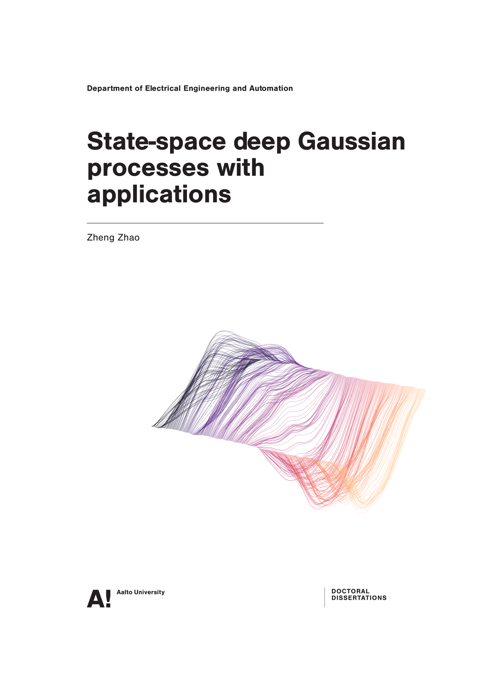

# Doctoral dissertation of Zheng Zhao


[](https://github.com/zgbkdlm/dissertation/actions/workflows/latex_compile.yml)

This thesis is mainly concerned with state-space methods for a class of deep Gaussian process (DGP) regression problems. As an example, one can think of a family of DGPs as solutions to stochastic differential equations (SDEs), and view their regression problems as filtering and smoothing problems. Additionally, this thesis also presents a few applications from (D)GPs, such as system identification of SDEs and spectro-temporal signal analysis.

Supervisor: Prof. Simo Särkkä.

Pre-examiners: Prof. Kody J. H. Law from The University of Manchester and Prof. David Duvenaud from University of Toronto.

Opponent: Prof. Manfred Opper from University of Birmingham.

The public defence of the thesis will be streamed online on December 10, 2021 at noon (Helsinki time) via Zoom link https://aalto.zoom.us/j/67529212279. It is free and open to everyone.

More details regarding the thesis itself can be found in its title pages.

# Contents

The dissertation is in `./dissertation.pdf`. Feel free to download and read~~

**Note that you may also find an "official" version in [aaltodoc](http://urn.fi/URN:ISBN:978-952-64-0603-9) published by Aalto University. However, it destroyed the PDF links and outline, making it very painful to read in computer/ipad/inktablet. I believe that you will feel more enjoyable reading `./dissertation.pdf` instead. In terms of content, the one here has no difference with the one in aaltodoc.**

1. `./dissertation.pdf`. The PDF of the thesis.
2. `./errata.md`. Errata of the thesis.
3. `./cover`. This folder contains a Python script that generates the cover image.
4. `./lectio_praecursoria`. This folder contains the presentation at the public defence of the thesis.
5. `./scripts`. This folder contains Python scripts that are used to generate some of the figures in the thesis.
6. `./thesis_latex`. This folder contains the LaTeX source of the thesis. Compiling the tex files here will generate a PDF the same as with `./dissertation.pdf`.

# Citation

Bibtex:

```bibtex
@phdthesis{Zhao2021Thesis,
	title = {State-space deep Gaussian processes with applications},
	author = {Zheng Zhao},
	school = {Aalto University},
	year = {2021},
}
```

Plain text: Zheng Zhao. *State-space deep Gaussian processes with applications*. PhD thesis, Aalto University, 2021.

# License

Unless otherwise stated, all rights belong to the author Zheng Zhao. This repository consists of files covered by different licenses, please check their licenses before you use them.

You are free to download, display, and print `./dissertation.pdf` for your own personal use. Commercial use of it is prohibited.

# Acknowledgement

I would like to thank [Adrien (Monte) Corenflos](https://adriencorenflos.github.io/), [Christos Merkatas](https://cmerkatas.github.io/), [Dennis Yeung](https://www.linkedin.com/in/dptyeung/?originalSubdomain=fi), and [Sakira Hassan](https://sakira.github.io/) for their time and efforts for reviewing and checking the languange of the thesis. 

# Contact

Zheng Zhao, zheng.zhao@aalto.fi
